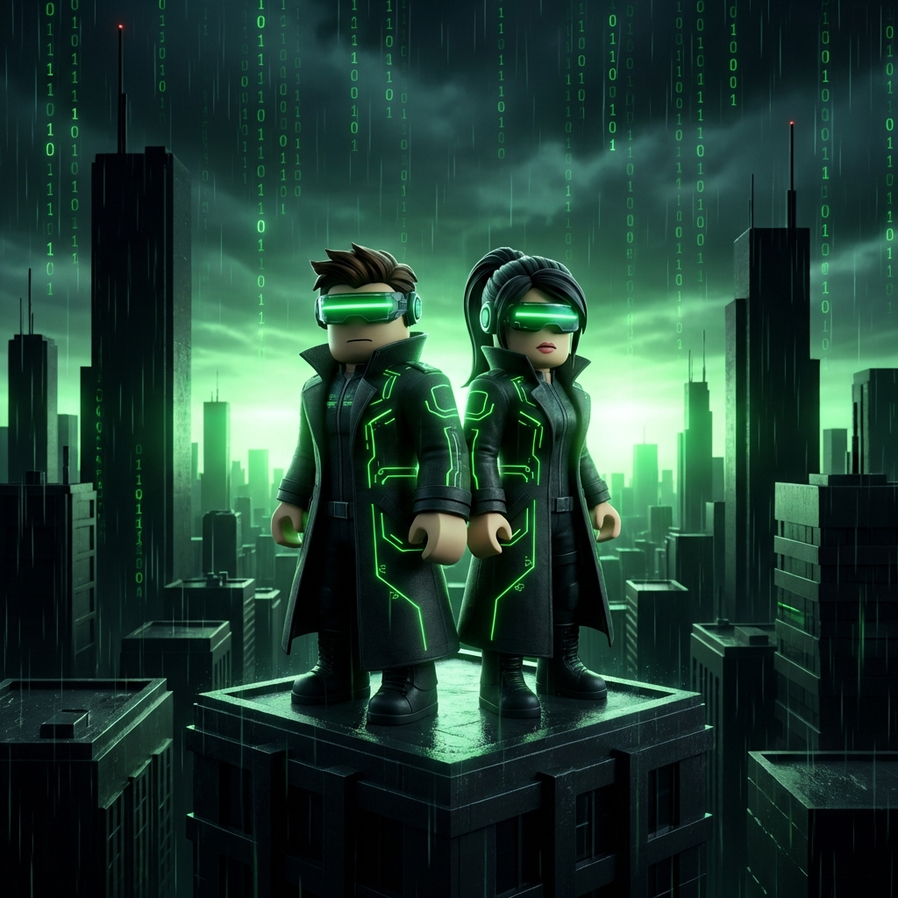
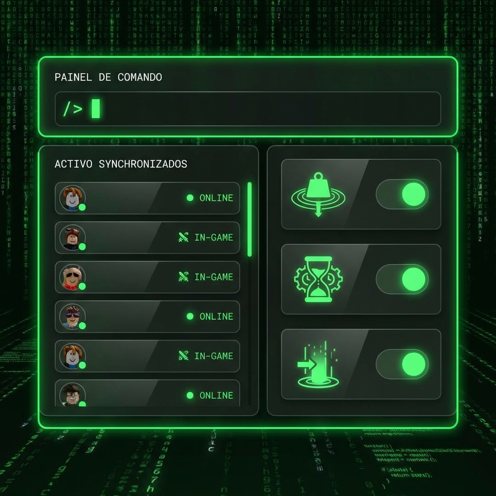

# 🕶️ NEO-ARK: Protocolo Symbeon


**NEO-ARK** é um ecossistema de jogo sistêmico e scifi construído para Roblox, utilizando o poder do **Rojo** para um fluxo de trabalho de engenharia profissional.

## 🌌 O Universo: Lore & História

Em um futuro onde a realidade física colapsou sob o peso da entropia digital, o que resta da consciência humana habita a **Malha Symbeon**.



- **A Malha (The Mesh):** Uma infraestrutura cristalina e poligonal que sustenta o vazio. Não é apenas código; é a última fronteira da existência.
- **Sincronizadores:** Você é um Sincronizador. Operadores de elite da **EZ-Fundation** treinados para estabilizar fragmentos de código, minerar segredos e defender Nodes críticos.
- **Echos:** Inteligências residuais e fragmentos de sistemas antigos que se tornaram hostis. Eles tentam "desfragmentar" qualquer intruso biológico que ouse navegar pelos setores instáveis.


No coração de NEO-ARK, a Arqueologia Digital do projeto **AION** revelou que o passado binário esconde as chaves para a soberania do futuro.

---

## 🚀 Arquitetura do Projeto

O projeto segue a estrutura padrão Rojo para máxima modularidade:



- `src/server`: Lógica autoritativa do servidor (DataStore, NPCs, Economia).
- `src/client`: Interfaces de usuário (HUD, Diálogos) e efeitos visuais locais.
- `src/shared`: Módulos compartilhados e definições de dados (Ink Runtime, Combat System).
- `narratives/`: Histórias branching escritas em **Ink.js** e compiladas para Luau.

## 🛠️ Setup de Desenvolvimento

### Pré-requisitos
- [Rojo](https://rojo.space/) (v7.0+)
- [Roblox Studio](https://www.roblox.com/create)
- [Visual Studio Code](https://code.visualstudio.com/)

### Como Rodar
1. No terminal, execute o servidor Rojo:
   ```bash
   rojo serve
   ```
2. No Roblox Studio, abra o plugin do Rojo e clique em **Connect**.
3. Os arquivos em `src/` serão sincronizados automaticamente com o Studio.

## 🌌 Visão Geral: Protocolo Symbeon (Vertical Slice v0.5)

**Status:** `[VERTICAL_SLICE_ACTIVE]`
**Meta:** Provar a convergência entre Gameplay, Narrativa Ink e Educação Técnica em um loop de 5 minutos.

### O Loop "Soberano":
1.  **Boot Injection (`TerminalBootManager`):** Injeção de código via terminal ASCII imersivo.
2.  **Sovereign Narrative (`InkRuntime`):** Linha do tempo interativa explicando a ascensão da IA.
3.  **Physical Calibration (`CalibrationManager`):** Teste de física que determina seu Arquétipo.
4.  **Visual Convergence (`SovereignSkinManager`):** Aplicação automática de identidade visual (Cores/VFX).

---

## 📚 Architect Academy: Logic Hacks

*"Aquele que escreve o código, governa a realidade."*

O sistema de **Logic Hacks** transforma desafios de programação em mecânicas de jogo (Heists).
- **Terminal UI Glitch-Noir:** Interface imersiva para injeção de scripts.
- **Currículo Real:** Módulos de Variáveis, Loops e Tabelas validados pelo servidor.
- **Proof of Learning (PoL):** Recompensas permanentes em XP e Multiplicadores econômicos.

---

## 🛡️ Sovereign Strategy

Este projeto segue o **Manifesto Soberano** (`ez-studios-core/docs/sovereign_strategy_manifesto.md`):
- **Roblox como Infraestrutura:** Usamos a plataforma pelo subsídio de servidores, não por dependência.
- **Código Agnóstico:** Lógica desacoplada pronta para migração futura.
- **Economia Dual-Layer:** Inflação controlada (EB) vs. Escassez Real (IDNA).

---
**Desenvolvido por [Symbeon Labs] com Antigravity Engine.** 🕶️🚀
